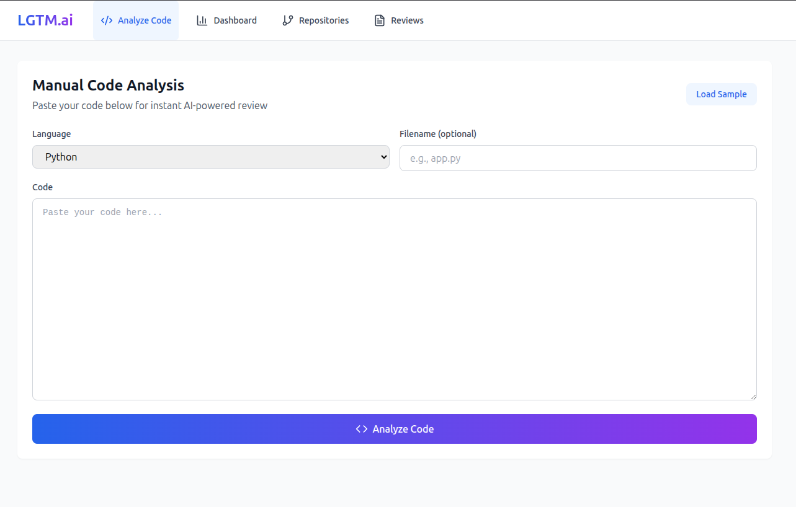
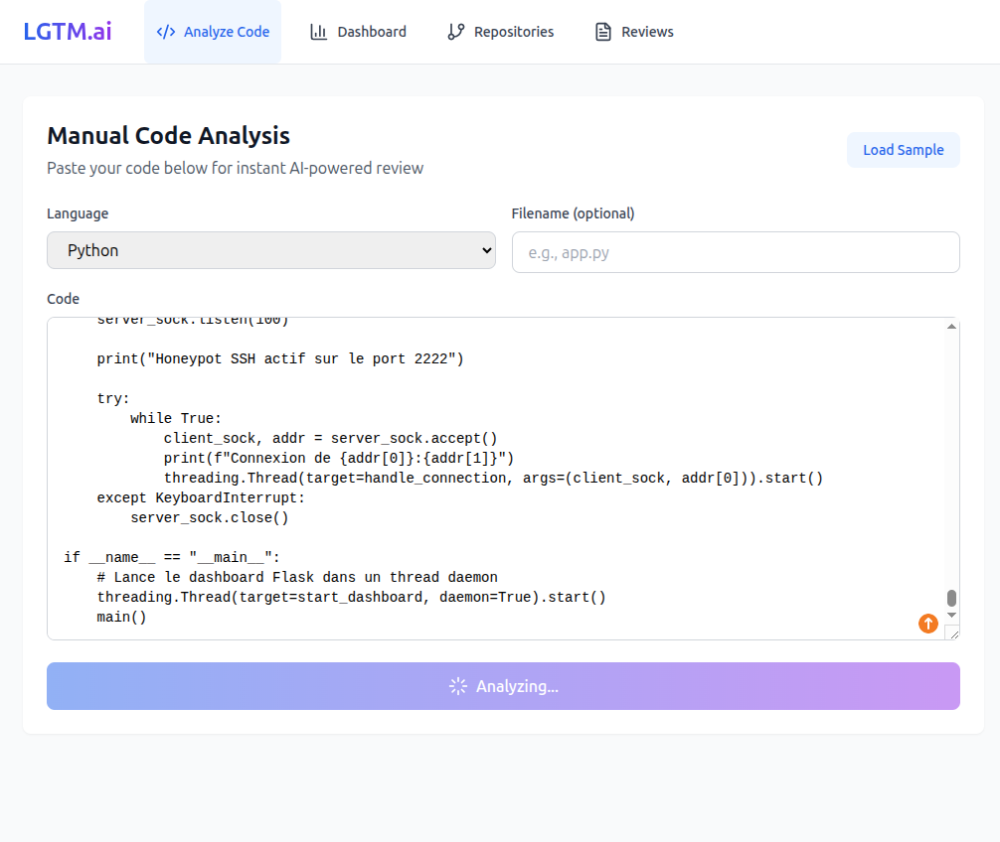
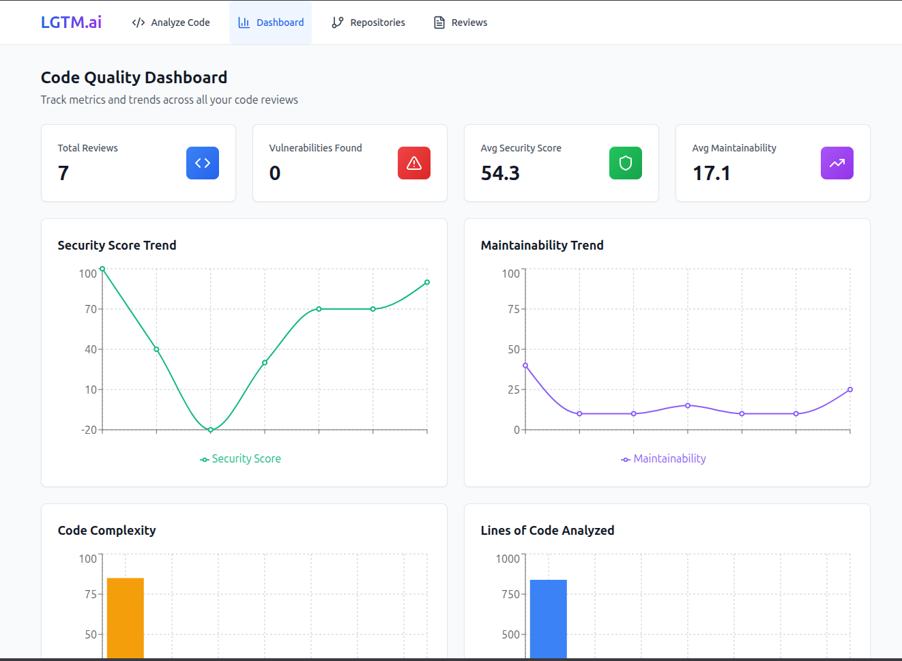
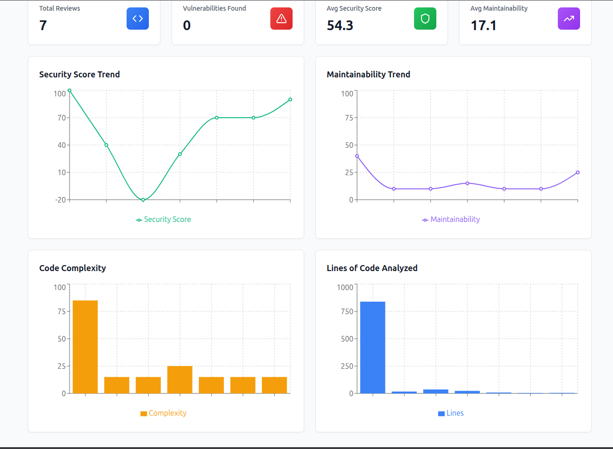
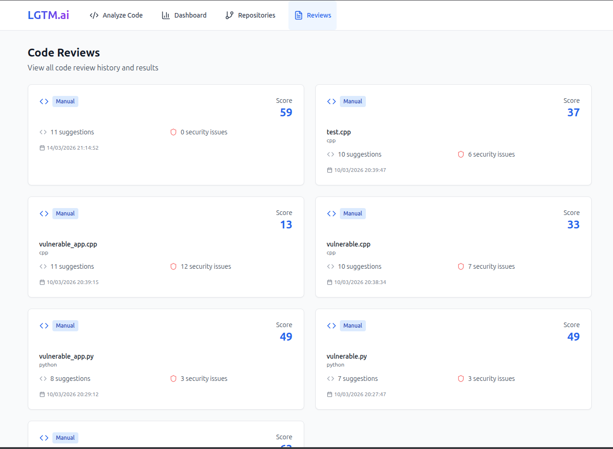
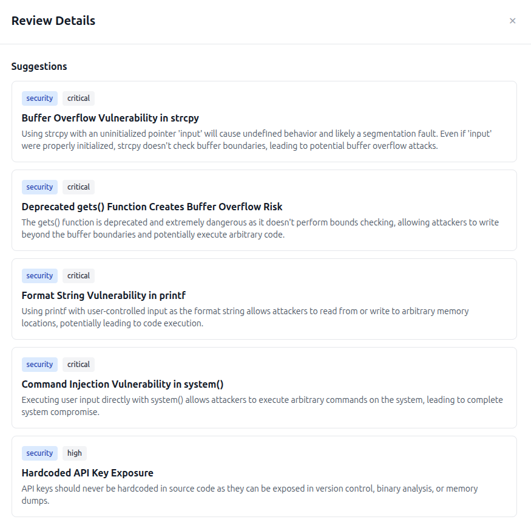

# 🤖 LGTM.ai - AI-Powered Code Review Assistant

   

**LGTM.ai** is an intelligent code review assistant that integrates with GitHub pull requests and provides AI-powered code analysis, security vulnerability detection, and architectural improvement suggestions. Built with Claude Sonnet 4.5, it goes beyond basic linting to understand context, suggest architectural improvements, and flag security issues.

## ✨ Features

### 🎯 Core Features
- **AI-Powered Code Analysis** - Deep code understanding using Claude Sonnet 4.5
- **Manual Code Review** - Paste code directly for instant analysis
- **GitHub PR Integration** - Automated reviews on pull requests via webhooks
- **Multi-Language Support** - Python, JavaScript/React, TypeScript, C++, C, HTML, CSS, SQL
- **Security Vulnerability Scanning** - Pattern-based detection of common security issues
- **Code Quality Metrics** - Track maintainability, complexity, and security scores over time
- **Visual Dashboard** - Beautiful charts and metrics visualization

### 🔍 What It Detects
- **Security Issues**: 
  - Python: SQL injection, XSS, command injection, hardcoded credentials, unsafe deserialization
  - JavaScript: eval(), innerHTML XSS, hardcoded keys, localStorage misuse
  - C/C++: Buffer overflows, format string bugs, memory leaks, command injection
  - SQL: SQL injection, dangerous operations
- **Architecture**: Design patterns, code organization, structure improvements
- **Performance**: Optimization opportunities, bottlenecks
- **Code Quality**: Maintainability, readability, best practices
- **Best Practices**: Language-specific conventions and standards


## Demo 









## 🏗️ Architecture

```
┌─────────────────────────────────────────────────────────────┐
│                      LGTM.ai System                         │
├─────────────────────────────────────────────────────────────┤
│                                                             │
│  ┌──────────────┐      ┌──────────────┐      ┌──────────┐ │
│  │   Frontend   │◄────►│   Backend    │◄────►│ MongoDB  │ │
│  │   (React)    │      │  (FastAPI)   │      │          │ │
│  └──────────────┘      └──────┬───────┘      └──────────┘ │
│                               │                             │
│                       ┌───────┴────────┐                    │
│                       │                │                    │
│                 ┌─────▼─────┐   ┌─────▼──────┐            │
│                 │  Claude    │   │  Security  │            │
│                 │ Sonnet 4.5 │   │  Scanner   │            │
│                 └────────────┘   └────────────┘            │
│                                                             │
└─────────────────────────────────────────────────────────────┘
                              │
                              ▼
                    ┌───────────────────┐
                    │  GitHub Webhooks  │
                    └───────────────────┘
```

## 🚀 Quick Start

### Prerequisites
- Python 3.11+
- Node.js 18+
- MongoDB
- Yarn package manager

### Installation

1. **Clone & Setup Backend**
```bash
cd /app/backend
pip install -r requirements.txt
```

2. **Setup Frontend**
```bash
cd /app/frontend
yarn install
```

3. **Configure Environment Variables**

Backend (`.env`):
```bash
EMERGENT_LLM_KEY=sk-emergent-31d39733207875d8e2
MONGO_URL=mongodb://localhost:27017/lgtm_ai
GITHUB_WEBHOOK_SECRET=your_webhook_secret_here
GITHUB_TOKEN=your_github_token_here  # Optional, for posting comments
```

Frontend (`.env`):
```bash
REACT_APP_BACKEND_URL=http://localhost:8001
```

4. **Start Services**
```bash
sudo supervisorctl restart all
```

The application will be available at:
- **Frontend**: http://localhost:3000
- **Backend API**: http://localhost:8001
- **API Docs**: http://localhost:8001/docs

## 📖 Usage

### Manual Code Analysis

1. Navigate to the "Analyze Code" page
2. Select your programming language
3. Paste your code or click "Load Sample"
4. Click "Analyze Code"
5. Review AI-powered suggestions and security findings

### GitHub Integration

#### Setup GitHub Webhook

1. Go to your GitHub repository
2. Navigate to **Settings → Webhooks → Add webhook**
3. Configure:
   - **Payload URL**: `https://your-domain.com/api/webhooks/github`
   - **Content type**: `application/json`
   - **Secret**: Your webhook secret from `.env`
   - **Events**: Select "Pull requests"
   - **Active**: ✓ Enabled

4. Add repository in LGTM.ai:
   - Go to "Repositories" page
   - Click "Add Repository"
   - Enter repository details
   - Save

#### Automated Reviews

Once configured, LGTM.ai will automatically:
- Detect new pull requests
- Analyze changed files
- Post review comments with suggestions
- Flag security vulnerabilities
- Track code quality metrics

## 🛠️ API Endpoints

### Code Analysis
```bash
# Manual code analysis
POST /api/analyze/manual
Content-Type: application/json

{
  "code": "your code here",
  "language": "python",
  "filename": "app.py"
}
```

### Repositories
```bash
# List repositories
GET /api/repositories

# Add repository
POST /api/repositories
{
  "repo_url": "https://github.com/user/repo",
  "repo_name": "my-repo",
  "owner": "username"
}
```

### Reviews
```bash
# Get all reviews
GET /api/reviews

# Get specific review
GET /api/reviews/{review_id}
```

### Metrics
```bash
# Get dashboard metrics
GET /api/metrics/dashboard
```

### Webhooks
```bash
# GitHub webhook receiver
POST /api/webhooks/github
```

## 📊 Dashboard Metrics

The dashboard tracks:
- **Total Reviews** - Number of code reviews performed
- **Vulnerabilities Found** - Security issues detected
- **Average Security Score** - Overall security health (0-100)
- **Average Maintainability** - Code quality trend (0-100)
- **Security Score Trend** - Historical security metrics
- **Maintainability Trend** - Code quality over time
- **Complexity Analysis** - Code complexity patterns
- **Lines of Code** - Volume of code analyzed

## 🔒 Security Scanner

Built-in pattern-based security scanner detects:

### Python
- `eval()` and `exec()` usage
- `pickle.loads()` unsafe deserialization
- `os.system()` command injection
- Hardcoded credentials
- SQL injection patterns

### JavaScript/TypeScript
- `eval()` usage
- `innerHTML` XSS vulnerabilities
- `dangerouslySetInnerHTML` in React
- Hardcoded API keys
- `localStorage` with sensitive data

### C/C++
- **Buffer Overflows**: `strcpy()`, `strcat()`, `gets()`, `sprintf()`, `scanf()`
- **Format String Bugs**: Improper `printf()` usage
- **Memory Issues**: Memory leaks, double free, unsafe `memcpy()`
- **Command Injection**: `system()` with user input
- **Unsafe Operations**: `reinterpret_cast`, weak `rand()`
- **Hardcoded Credentials**: Embedded secrets in code

### SQL
- String concatenation in queries
- Dangerous DROP TABLE statements

## 🎨 Tech Stack

### Backend
- **Framework**: FastAPI
- **Database**: MongoDB
- **AI Model**: Claude Sonnet 4.5 (via Emergent Integrations)
- **HTTP Client**: httpx
- **GitHub API**: PyGithub

### Frontend
- **Framework**: React 18
- **Styling**: Tailwind CSS
- **Charts**: Recharts
- **Icons**: Lucide React
- **Syntax Highlighting**: react-syntax-highlighter
- **HTTP Client**: Axios

## 📁 Project Structure

```
/app/
├── backend/
│   ├── server.py              # Main FastAPI application
│   ├── services/
│   │   ├── code_analyzer.py   # Claude Sonnet integration
│   │   ├── github_service.py  # GitHub API wrapper
│   │   └── security_scanner.py # Pattern-based security scan
│   ├── requirements.txt
│   └── .env
│
├── frontend/
│   ├── src/
│   │   ├── App.js            # Main React component
│   │   ├── components/
│   │   │   ├── ManualAnalysis.js
│   │   │   ├── Dashboard.js
│   │   │   ├── Repositories.js
│   │   │   └── Reviews.js
│   │   ├── index.js
│   │   ├── index.css
│   │   └── App.css
│   ├── public/
│   ├── package.json
│   └── .env
│
└── README.md
```

## 🧪 Testing

### Test Backend API
```bash
# Health check
curl http://localhost:8001/api/health

# Test code analysis
curl -X POST http://localhost:8001/api/analyze/manual \
  -H "Content-Type: application/json" \
  -d '{
    "code": "def test(): pass",
    "language": "python"
  }'
```

### Test Frontend
```bash
# Open in browser
open http://localhost:3000

# Check build
cd /app/frontend
yarn build
```

## 🌟 Key Features in Detail

### 1. Deep Code Analysis
Unlike basic linters, LGTM.ai:
- Understands code context across multiple files
- Suggests architectural improvements
- Provides actionable recommendations
- Explains *why* something is an issue

### 2. Security First
- Pattern-based detection for instant results
- AI-powered analysis for complex vulnerabilities
- Severity classification (critical, high, medium, low)
- Detailed remediation guidance

### 3. Production-Ready
- Background job processing
- Webhook signature verification
- Error handling and logging
- Scalable architecture
- MongoDB for persistent storage

### 4. Developer Experience
- Beautiful, intuitive UI
- Real-time analysis feedback
- Syntax highlighting
- Visual metrics dashboard
- Easy GitHub integration

## 📈 Metrics & Analytics

Track code quality trends:
- **Security Score**: Measures security posture
- **Maintainability**: Code readability and structure
- **Complexity**: Cyclomatic complexity indicators
- **Historical Trends**: See improvements over time

## 🤝 Contributing

This is a demonstration project showing:
- Production-level AI integration
- Real-world problem solving
- Full-stack development skills
- Security-focused design
- Clean architecture patterns

## 📄 License

MIT License - Built as a portfolio project demonstrating advanced AI integration and full-stack development capabilities.

## 🎯 Business Impact

LGTM.ai addresses real engineering team pain points:
- **Time Savings**: Automated initial reviews
- **Quality Improvement**: Catch issues early
- **Knowledge Sharing**: Learn from AI suggestions
- **Security**: Prevent vulnerabilities before deployment
- **Metrics**: Data-driven code quality decisions

## 🔗 Links

- **API Documentation**: http://localhost:8001/docs
- **Frontend**: http://localhost:3000
- **GitHub**: https://github.com/Amayes985-stack/LGTM.ai

---

**LGTM** = Looks Good To Me 👍
